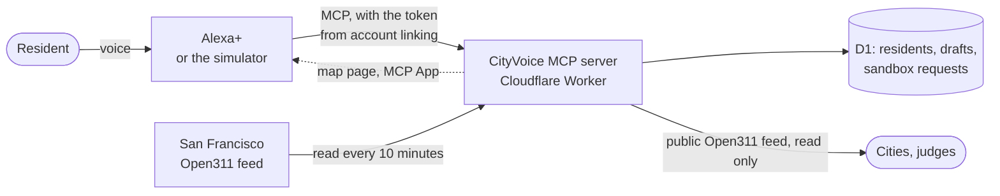

# CityVoice

[](https://github.com/elielMengue/cityvoice/actions/workflows/ci.yml)

Report a problem in your street to your city just by talking to Alexa.

A resident says "there's a huge pothole at 14th and U". CityVoice finds the
place, asks the one question the city needs, reads the report back, and files
it once the resident says yes. If a neighbor already reported the same thing,
it offers to add their support instead of filing a duplicate. Anything that
sounds dangerous goes to 911, and nothing is filed. Later, "what's happening
with my reports?" gets an answer in plain words, with a map on screens.

CityVoice is an MCP server for Alexa+, built on
[Open311 GeoReport v2](https://wiki.open311.org/GeoReport_v2/), the open
standard many US cities already use for their 311 services.

Built for the Alexa+ track of
[Build, Ship, Shape: Amazon Developer Hackathon 2026](https://amazonappdev2026.devpost.com/).

## Try it in two minutes

Nothing to install. Open the
**[Alexa+ simulator](https://cityvoice-simulator.demop.workers.dev)** in
Chrome or Edge, select **Link account**, and pick a demo resident. Then tap
the microphone and talk; it keeps listening after each answer until you say
"that's all". The accessibility button next to it lets you type instead.

| Scenario                   | Link as | Say                                                                      |
| -------------------------- | ------- | ------------------------------------------------------------------------ |
| A. Report a pothole        | Daniel  | "There's a huge pothole at 14th and U Street", then "In the road", "Yes" |
| B. Support a neighbor      | Maria   | "The streetlight in front of my house is out", then "Add my support"     |
| C. Follow up, with a map   | Aisha   | "What's happening with my reports?"                                      |
| D. An emergency            | Anyone  | "There's a gas smell in my building"                                     |
| A real city, San Francisco | Sam     | "What's been reported around 16th and Mission?"                          |

To switch residents, select **Unlink**, then link again.

**Check a report the way a city would.** After filing one, open **Behind the
scenes** (the `<>` button) and select **View the Open311 record** under
`submit_report`. It opens the request in CityVoice's public, read-only
[Open311 feed](https://cityvoice.demop.workers.dev/open311/v2/requests.json),
in the exact format 311 systems read. The same panel shows every MCP call
Alexa made, with its arguments, its answer and its timing.

**What is real and what is not.** The places are real, and so are San
Francisco's requests: they come from the city's own Open311 feed. Washington
DC's residents and reports are made up for the demo. No report is ever sent to
a city: they go to a sandbox that behaves like a city's Open311 server.
Sending them for real takes a write adapter and an API key from the city,
which we did not do without a partnership.

## How it works



- **Alexa+ understands, CityVoice acts.** Alexa+ turns speech into tool calls.
  The server holds no language model: its tools are plain code that do their
  work in tens of milliseconds, and each returns a sentence ready to be spoken
  along with the data behind it.
- **Account linking** is OAuth 2.1 with PKCE, as the Alexa+ MCP Toolkit
  requires. It links a resident's Alexa account to their CityVoice account, so
  CityVoice knows who is speaking and where they live. In the demo, signing in
  means picking a resident.
- **The map** is an [MCP App](https://github.com/modelcontextprotocol/ext-apps):
  a page Alexa+ shows next to the answer on screens. It draws exactly what was
  said, so the voice and the screen always agree, and it stays hidden when
  there is nothing to show.
- **Each resident belongs to a city.** Washington DC runs on demo data. San
  Francisco's real requests are mirrored by a scheduled job, because its feed
  takes seconds to answer, far too long for a voice turn.

### The MCP contract

| Tool                  | What it does                                                                              |
| --------------------- | ----------------------------------------------------------------------------------------- |
| `start_report`        | The first answer in one call: emergency screen, service, place, neighbors' reports, draft |
| `resolve_location`    | Turns "14th and U" or "in front of my house" into a confirmed place                       |
| `list_service_types`  | Finds the city service for the problem, and stops at emergencies                          |
| `find_nearby_reports` | Checks whether neighbors already reported the same thing close by                         |
| `draft_report`        | Builds the report over several turns and asks what the city still needs                   |
| `submit_report`       | Sends the draft after an explicit yes; safe to retry                                      |
| `support_report`      | Adds the resident's support to a neighbor's report, once per person                       |
| `get_my_reports`      | Tells the resident where their reports stand, with a map                                  |
| `show_report_map`     | Shows and says what was reported around a place, or what changed this week                |
| `ping`                | Checks that the service is up                                                             |

There is also a resource, `cityvoice://services/{city}`, with each city's
catalog of services, and a prompt, `neighborhood_update`: "What's new around
my home this week?"

`start_report` exists for speed. Each tool call costs the assistant a round of
thinking, and a report used to need four of them before the first question.
Now it needs one. The single-step tools stay for corrections, like "no, it's
on 15th Street".

## Run it yourself in ten minutes

You need [Bun](https://bun.sh) 1.3 or later. Everything else installs with
it.

```bash
git clone https://github.com/elielMengue/cityvoice.git
cd cityvoice
bun install
```

**The MCP server alone.** No account needed:

```bash
cd server
DEMO_RESIDENT=aisha bun dev
```

The MCP endpoint is at `http://localhost:8080/mcp`. Call a tool with the MCP
Inspector, for example:

```bash
npx @modelcontextprotocol/inspector --cli http://localhost:8080/mcp --transport http --method tools/call --tool-name get_my_reports
```

This demo mode trusts the caller completely: the resident comes from
`DEMO_RESIDENT` or the `x-cityvoice-demo-resident` header. It refuses to start
in production.

**The simulator.** It needs a language model. Copy
`simulator/.env.example` to `simulator/.env.local`, then either add a free
Gemini API key there, or leave it empty and sign in to Cloudflare once with
`bunx wrangler login` to use Workers AI. Then:

```bash
cd simulator
bun run dev
```

Open `http://localhost:8791`. It talks to the CityVoice server online, so
account linking works as it does for Alexa+.

**Everything on your machine,** with account linking and the database as in
production, still without a Cloudflare account for the server:

```bash
cd server
bun run db:migrate:local
bun run db:seed:local
bun run worker:dev:oauth
```

Register the local simulator once with
`bun scripts/registerClient.ts http://localhost:8790 --name "Local simulator" --redirect http://localhost:8791/callback --public`,
then start it with
`bun run dev --var CITYVOICE_URL:http://localhost:8790 --var CLIENT_ID:<the printed id>`.
`bun run smoke:oauth` walks through account linking the way Alexa+ does and
checks every step.

## Checks

From the repository root:

```bash
bun run typecheck
bun run lint
bun run test
```

The tests play the four scenarios end to end against both the in-memory and
the SQL adapters, check every spoken sentence against the voice rules (short,
no codes, nothing visual), and never reach the network. CI runs the same
checks on every push.

## Repository layout

| Path         | What it is                                                     |
| ------------ | -------------------------------------------------------------- |
| `server/`    | The MCP server, its map page and its public pages              |
| `simulator/` | The Alexa+ simulator: a web page and a Worker                  |
| `addon/`     | The Alexa+ add-on manifest and the sources of its images       |
| `docs/`      | Engineering practices, the add-on runbook and the friction log |

The add-on is packaged and ready to deploy with Amazon's Alexa AI CLI; see the
[runbook](docs/alexa-addon.md).

## Design choices

- **Ports and adapters.** Geocoding, the city's 311 system and resident
  storage sit behind interfaces. A sandbox, a city's real feed and a database
  plug in without touching the tools.
- **Stateless MCP layer.** Every MCP request is served by a fresh server
  instance, with no MCP sessions. What must be remembered, like drafts and who
  supports what, lives in the database, so any instance can answer any call.
- **Speech and data together.** Every tool builds the spoken sentence and the
  structured data in one place, so they cannot disagree.
- **Location ids carry the place.** A `location_id` encodes the address and
  coordinates, so the next tool needs no lookup and no shared cache.
- **Safe to retry.** Alexa may repeat a call when a response is slow. Filing a
  report and supporting one are both protected, so a repeated or parallel call
  never files twice or counts anyone twice.
- **Safety stays in code.** The emergency screen is plain code in the server,
  never left to a language model.

More in [docs/engineering-practices.md](docs/engineering-practices.md), and
what got in our way in [docs/friction-log.md](docs/friction-log.md).

## Protecting the free tier

Everything runs on free plans, so abuse could stop the demo for everyone.
Client registration is closed in production; a daily budget counted in D1 caps
the OAuth requests that write to KV; per-minute limits slow floods down on the
OAuth routes, MCP calls and simulator turns; and the San Francisco mirror only
writes the requests that changed.

## License

[MIT](LICENSE)
